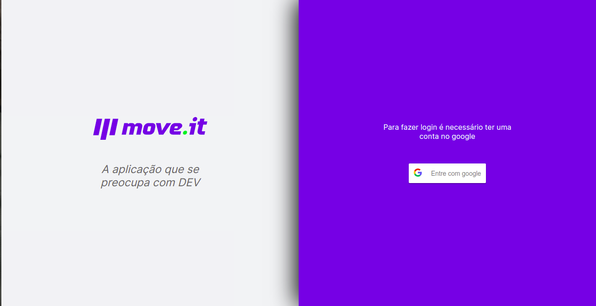
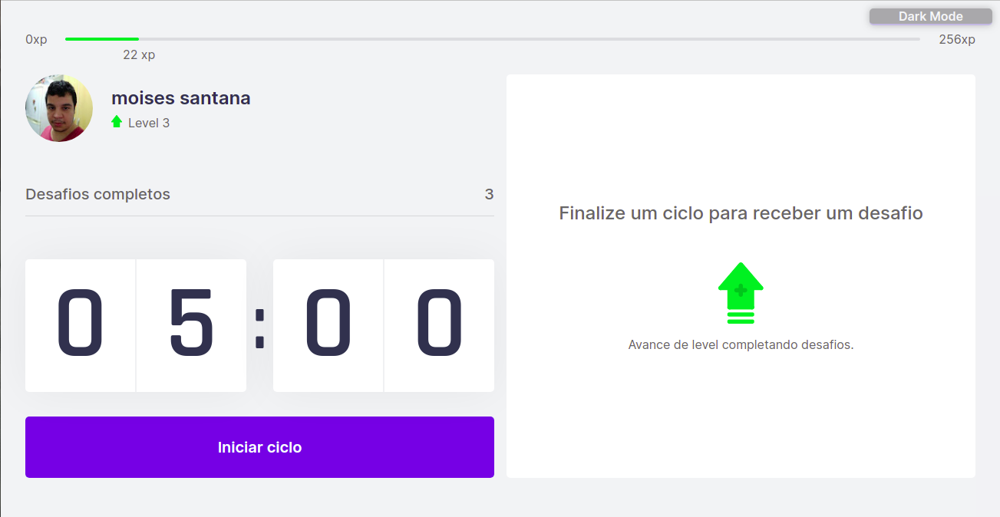
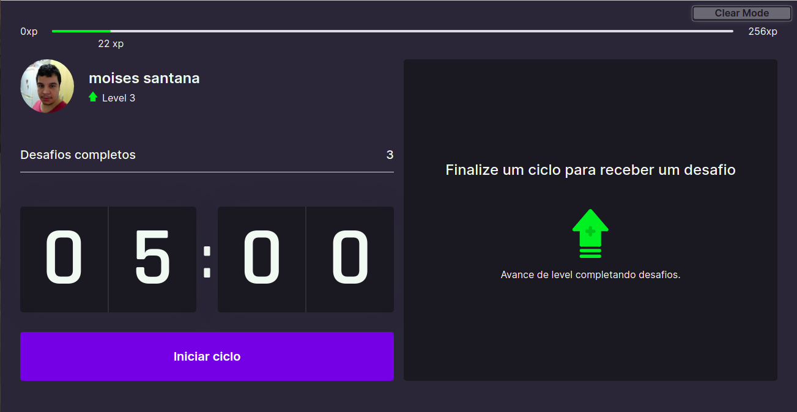
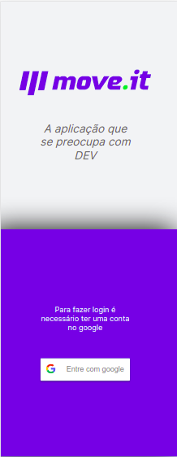
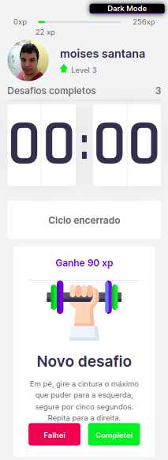
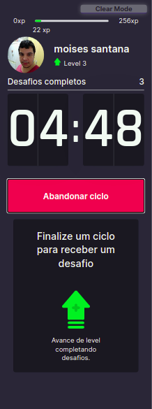

# Move It

Move It é um projeto de uma semana proposta pela RocketSeat para ver e aperfeiçoar os conhecimentos de front end, foi utilizada muitas tecnologias como React Hooks, Context API, Type Script, Next.js entre outras, e o incentivo para levar o projeto para o próximo nível (bordão do Diego) responsável por nos guiar nesse projeto.

## Proposta do projeto

A proposta do Move It era criar uma aplicação web não responsiva, onde era possível iniciar um contador de 5 minutos, após o timer zerar o navegador envia um alerta para fazer algum exercício, você pode concluir ou rejeitar, possui uma barra de xp e após avançar de nível é mostrado uma janela para parabenizar, para não perder o progresso os dados são guardados nos cookies do navegador.
## Avançando para o próximo nível

Para exercitar os conhecimentos adquiridos e fazer uma aplicação mais completa fiz alguns incrementos ao projeto como:

- Tela de login
- Login pela conta do google
- Rota para a tela do jogo
- Aplicação responsiva
- Dark Mode

### Imagens do projeto

#### Desktop



##### Clean Mode



##### Dark Mode



#### Mobile



##### Clean Mode



##### Dark Mode



## Rodando o projeto em sua maquina

- ``` git clone ```
- ``` npm install ```
- ``` npm run dev ``` 

Você também pode utilizar a aplicação acessando:

> https://nlw4-moveit-black.vercel.app
